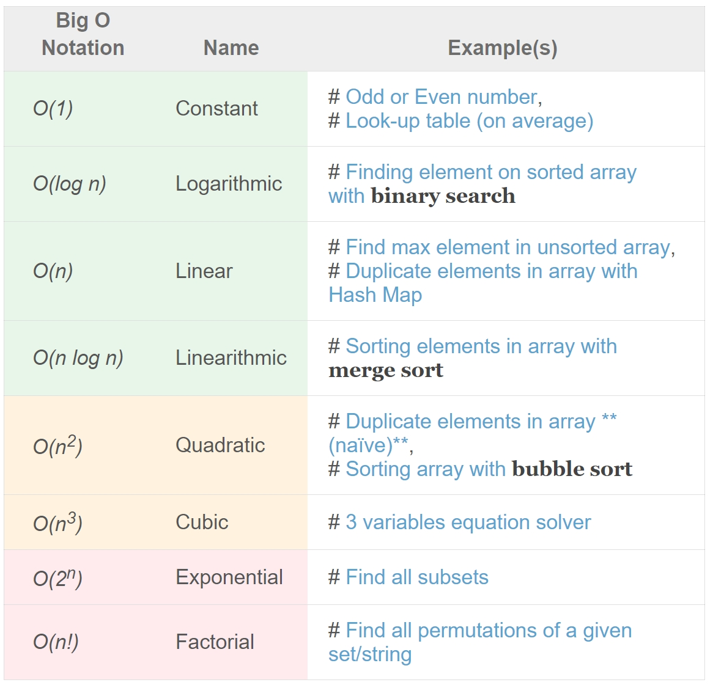

# [Algorithms](https://confluence.softserveinc.com/display/AbilitonKnowledgeModel/Algorithms)

__Qualification Requirements Overview:__  
Base algorithm knowledge that should be sufficient to implement basic tasks with necessary performance.

## Algorithms complexity (understanding, big O notation, complexity of common algorithms)

How quickly it grows relative to the input, as the input gets arbitrarily large.  

Big O notation is a mathematical notation that describes the limiting behavior of a function when the argument tends towards a particular value or infinity.  

In computer science, big O notation is used to classify algorithms according to how their running time or space requirements grow as the input size grows.  

Some rules:
* Drop the constants.
* Drop the less significant terms
* Usually talking about the "worst case"

Types of complexity:
* Constant Time: O(1)
* Linear Time: O(n)
* Logarithmic Time: O(log n)
* Quadratic Time: O(n^2)
* Cubic time O(n^3)	
* Exponential time O(2^n)
* Factorial time O(n!)

#### Some examples:  

### Analysis of Algorithms
The term analysis of algorithms is used to describe approaches to the study of the performance of algorithms. In this course we will perform the following types of analysis:
* the worst-case runtime complexity of the algorithm is the function defined by the maximum number of steps taken on any instance of size a.
* the best-case runtime complexity of the algorithm is the function defined by the minimum number of steps taken on any instance of size a.
* the average case runtime complexity of the algorithm is the function defined by an average number of steps taken on any instance of size a.
*  the amortized runtime complexity of the algorithm is the function defined by a sequence of operations applied to the input of size a and averaged over time.

### NP-complete
A problem is NP-complete when it can be solved by a restricted class of brute force search algorithms and it can be used to simulate any other problem with a similar algorithm.  

### Polynomial time
An algorithm is said to be of polynomial time if its running time is upper bounded by a polynomial expression in the size of the input for the algorithm, i.e., T(n) = O(nk) for some positive constant k.  

## Array sorting methods(bubble sort, quick sort, merge sort)

### [Bubble sort](https://www.geeksforgeeks.org/bubble-sort)
Based on the idea of repeatedly comparing pairs of adjacent elements and then swapping their positions if they exist in the wrong order.  
### [Merge sort](https://www.geeksforgeeks.org/merge-sort)
Is a divide-and-conquer algorithm based on the idea of breaking down a list into several sub-lists until each sublist consists of a single element and merging those sublists in a manner that results into a sorted list.  

Idea:
* Divide the unsorted list into  sublists, each containing  element.
* Take adjacent pairs of two singleton lists and merge them to form a list of 2 elements.  will now convert into  lists of size 2.
* Repeat the process till a single sorted list of obtained.

While comparing two sublists for merging, the first element of both lists is taken into consideration. While sorting in ascending order, the element that is of a lesser value becomes a new element of the sorted list. This procedure is repeated until both the smaller sublists are empty and the new combined sublist comprises all the elements of both the sublists.  

### [Quick sort](https://www.geeksforgeeks.org/quick-sort)
Quick sort is based on the divide-and-conquer approach based on the idea of choosing one element as a pivot element and partitioning the array around it such that: Left side of pivot contains all the elements that are less than the pivot element Right side contains all elements greater than the pivot.  

It reduces the space complexity and removes the use of the auxiliary array that is used in merge sort. Selecting a random pivot in an array results in an improved time complexity in most of the cases.  

## Tree structure(construction, traversal)

The algorithm finds data by repeatedly making choices at decision points called __nodes__. A node can have as few as two branches (also called children), or as many as several dozen.  

In a tree, records are stored in locations called __leaves__.  
This name derives from the fact that records always exist at end points; there is nothing beyond them.  

The starting point is called the __root__. The maximum number of children per node is called the __order of the tree__.  
The maximum number of access operations required to reach the desired record is called the __depth__.

In some trees, the order is the same at every node and the depth is the same for every record. This type of structure is said to be __balanced__.  
Other trees have varying numbers of children per node, and different records might lie at different depths. In that case, the tree is said to have an __unbalanced__ or __asymmetrical__ structure. 

### Binary Tree

A tree whose elements have at most 2 children is called a binary tree. Since each element in a binary tree can have only 2 children, we typically name them the left and right child.  

A Binary Tree node contains following parts:
1. Data
2. Pointer to left child
3. Pointer to right child

### Traversal

__Level Order Tree Traversal__

Breadth-first search (BFS) is an algorithm for traversing or searching tree or graph data structures. It starts at the tree root, and explores all of the neighbor nodes at the present depth prior to moving on to the nodes at the next depth level.  

__Depth-first search (DFS)__

The algorithm starts at the root node and explores as far as possible along each branch before backtracking.  

  
Depth First Traversals:  
(a) Inorder (Left, Root, Right) : 4 2 5 1 3  
(b) Preorder (Root, Left, Right) : 1 2 4 5 3  
(c) Postorder (Left, Right, Root) : 4 5 2 3 1  

## Binary search algorithm	
Search a sorted array by repeatedly dividing the search interval in half. Begin with an interval covering the whole array. If the value of the search key is less than the item in the middle of the interval, narrow the interval to the lower half. Otherwise narrow it to the upper half. Repeatedly check until the value is found or the interval is empty.  

The idea of binary search is to use the information that the array is sorted and reduce the time complexity to O(Log n).  

## Hash table(creating, collisions)

### Hash function
A hash function is any function that can be used to map data of arbitrary size onto data of a __fixed size__.  
Hash functions accelerate table or database lookup by detecting duplicated records in a large file. One such application is finding similar stretches in DNA sequences. They are also useful in cryptography.   

### Collision
Collision or clash is a situation that occurs when two distinct pieces of data have the same hash value, checksum, fingerprint, or cryptographic digest.  
When we have 2 inputs x and y, for hash-function H, where H(x)=H(y)

HashMap doesn’t allow duplicate keys but allows duplicate values.  
Allows 'null' as key (only once as any other keys).  

Internally HashMap contains an array of Node and a node is represented as a class which contains 4 fields :
1. int hash
2. K key
3. V value
4. Node next

* Initial Capacity - is the capacity of HashMap instance when it is created
* Load Factor - is a measure that when rehashing should be done

### Time complexity of HashMap

HashMap provides constant time complexity for basic operations, get and put, if hash function is properly written and it disperses the elements properly among the buckets. Iteration over HashMap depends on the capacity of HashMap and number of key-value pairs. Basically, it is directly proportional to the capacity + size.  

## Stack, queue, linked list(construction, understanding, usage)

### [Stack](https://www.studytonight.com/data-structures/stack-data-structure.php)
Stack is an data structure with a bounded(predefined) capacity. It is a simple data structure that allows adding and removing elements in a particular order. Every time an element is added, it goes on the top of the stack and the only element that can be removed is the element that is at the top of the stack, just like a pile of objects.  

#### Basic features
* Stack is an ordered list of similar data type.
* Stack is a __LIFO(Last in First out)__ structure or we can say __FILO(First in Last out)__.
* push() function is used to insert new elements into the Stack and pop() function is used to remove an element from the stack. Both insertion and removal are allowed at only one end of Stack called Top.
* Stack is said to be in Overflow state when it is completely full and is said to be in Underflow state if it is completely empty.

#### Applications of Stack
* Reverse string
* Parsing
* Expression Conversion(Infix to Postfix, Postfix to Prefix etc)

### [Queue](https://www.studytonight.com/data-structures/queue-data-structure.php)
Is a data structure, just like stack data structure, in which the first element is inserted from one end called the REAR(also called tail), and the removal of existing element takes place from the other end called as FRONT(also called head).  

This makes queue as __FIFO(First in First Out)__ data structure, which means that element inserted first will be removed first.

#### Basic features
* Like stack, queue is also an ordered list of elements of similar data types.
* Queue is a FIFO( First in First Out ) structure.
* Once a new element is inserted into the Queue, all the elements inserted before the new element in the queue must be removed, to remove the new element.
* peek( ) function is oftenly used to return the value of first element without dequeuing it.

#### Applications of Queue
* Serving requests on a single shared resource, like a printer, CPU task scheduling etc.
* In real life scenario, Call Center phone systems uses Queues to hold people calling them in an order, until a service representative is free.                           
* Handling of interrupts in real-time systems. The interrupts are handled in the same order as they arrive i.e First come first served.

### [Linked list](https://www.studytonight.com/data-structures/introduction-to-linked-list.php)
Сonsists of group of nodes in a sequence.
Each node holds its own data and the address of the next node hence forming a chain like structure.

#### Advantages
* They are a dynamic in nature which allocates the memory when required.
* Insertion and deletion operations can be easily implemented.
* Stacks and queues can be easily executed.
* Linked List reduces the access time.

#### Disadvantages
* The memory is wasted as pointers require extra memory for storage.
* No element can be accessed randomly; it has to access each node sequentially.
* Reverse Traversing is difficult in linked list.

#### Applications of Linked Lists
* Linked lists are used to implement stacks, queues, graphs, etc.
* Linked lists let you insert elements at the beginning and end of the list.
