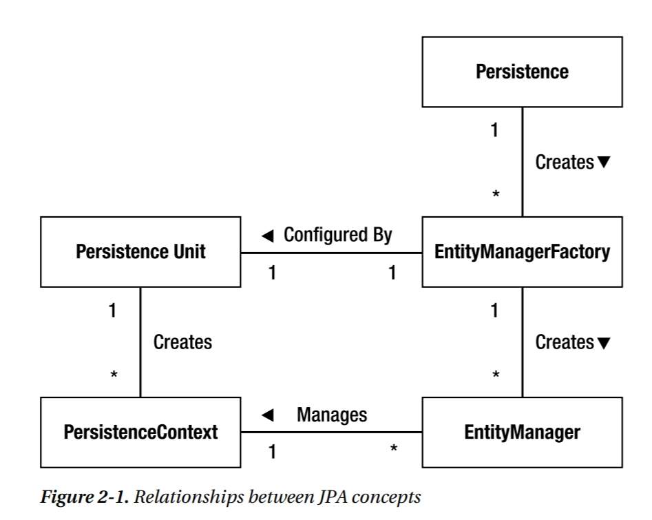

https://confluence.softserveinc.com/display/AbilitonKnowledgeModel/Construction-DB+Access-Java 
# Qualified
This level requires knowledge of the JDBC and JPA fundamentals, and Entity manipulation techniques

## Processing SQL Statements with JDBC:

### Establishing a Connection

### Using Statements and Prepared Statements

### Retrieving and Modifying Values from Result Sets

https://docs.oracle.com/javase/tutorial/jdbc/basics/retrieving.html

### [Using Transactions](https://docs.oracle.com/javase/tutorial/jdbc/basics/transactions.html)

When a connection is created, it is in auto-commit mode.  

## Understanding object/relational mapping concepts

The technique of bridging the gap between the object model and the relational model is known as
object-relational mapping, often referred to as O-R mapping or simply ORM.   

* Objects, not tables
* Convenience, not ignorance
* Unobtrusive, not transparent
* Legacy data, new objects
* Enough, but not too much
* Local, but mobile

## JPA: EntityManager, Persistence Context, Persistence Unit and EntityManagerFactory concepts

https://habr.com/ru/post/265061/ 

https://easyjava.ru/data/jpa/jpa-entitymanager-upravlyaem-sushhnostyami/ 

The Java Persistence API is a lightweight, POJO-based framework for Java persistence.   

Entity: 
An entity is essentially a noun, or a grouping of state associated together as a single unit.  
Described entities as things that have attributes and relationships. The expectation was that the attributes and relationships would be
persisted in a relational database.  

Properties:
* Persistability
It means that their state can be represented in a data store and can be accessed at a later time  
* Identity
* Transactionality
* Granularity

### Entity Manager 

It is to an entity manager that the real work of persistence is delegated.   

API to manipulate with entities is implemented by the entity manager and encapsulated almost entirely within a single interface called EntityManager.   

Entity managers are configured to be able to persist or manage specific types of objects, read and write to a given database, and be implemented by a particular persistence provider  

### Persistence context
The set of managed entity instances within an entity manager at any given time is called its persistence context. Only one Java instance with the same persistent identity may exist in a persistence context at any time.  

### Persistence unit and EntityManagerFactory
All entity managers come from factories of type EntityManagerFactory. The configuration for an
entity manager is templated from the EntityManagerFactory that created it, but it is defined separately
as a persistence unit. A persistence unit dictates either implicitly or explicitly the settings and entity
classes used by all entity managers obtained from the unique EntityManagerFactory instance bound to
that persistence unit. There is, therefore, a one-to-one correspondence between a persistence unit
and its concrete EntityManagerFactory.
Persistence units are named to allow differentiation of one EntityManagerFactory from another.
This gives the application control over which configuration or persistence unit is to be used for
operating on a particular entity. 

## JPA Object-Relational Mapping	

### Annotations for Object/Relational Mapping

https://easyjava.ru/data/jpa/jpa-entity-mapping/

### Mapping to a Table

### Mapping Simple Types

### Mapping the Primary Key

### Mapping Relationships (Unidirectional, Bidirectional, Many-to-One, One-to-One, Many-to-Many)

https://easyjava.ru/data/jpa/jpa-i-svyazi-mezhdu-obektami/

### Embedded Objects

### Collection Mapping

## Entity Operations basics

### Entity Instance Creation 

### Persisting an Entity Instance 

### Entity removal 
