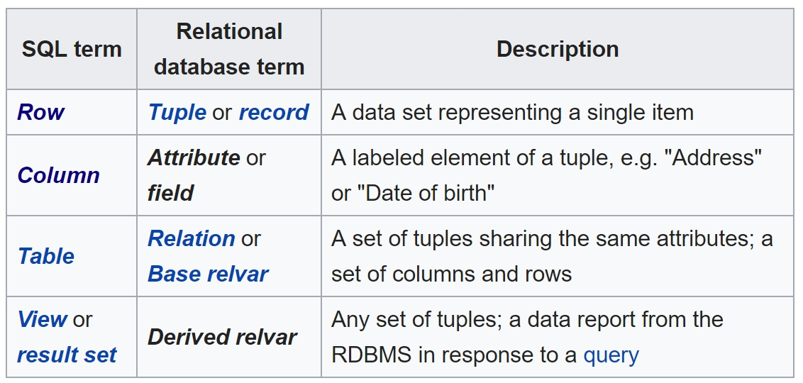

# (Design - DB Design)[https://confluence.softserveinc.com/display/AbilitonKnowledgeModel/Design-DB+Design]

A database is an organized collection of data, generally stored and accessed electronically from a computer system.  

## [Relational database](https://en.wikipedia.org/wiki/Relational_database)
A relational database is a digital database based on the relational model of data.  

This model organizes data into one or more tables (or "relations") of columns and rows, with a unique key identifying each row.  
Rows are also called records or tuples.  
Columns are also called attributes. Generally, each table/relation represents one "entity type" (such as customer or product).  
The rows represent instances of that type of entity (such as "Lee" or "chair") 
and the columns representing values attributed to that instance (such as address or price).  

The purpose of the relational model is to provide a declarative method for specifying data and queries:   
users directly state what information the database contains and what information they want from it, 
and let the database management system software take care of describing data structures for storing the data 
and retrieval procedures for answering queries.  

* Present the data to the user as relations (a presentation in tabular form, i.e. as a collection of tables with each table consisting of a set of rows and columns);
* Provide relational operators to manipulate the data in tabular form.  

### The general structure of a relational database

## Terminology 

### Entities
An entity is any object in the system that we want to model and store information about.  
Entities are usually recognizable concepts, either concrete or abstract, such as person, places, things, 
or events which have relevance to the database.  
Some specific examples of entities are Employee, Student, Lecturer.  

### Attributes
An attribute defines the information about the entity that needs to be stored.  
For example, the entity 'lecturer' could have attributes such as staff id, surname, forename, date of birth, telephone number, etc.  
An attribute can only appear in one entity, unless it is the key attribute in another entity.  
In a traditional filing system an attribute equates to a field in a record.

### Records (Tuples)
A complete set of information. Records are composed of fields, each of which contains one item of information.  
In a relational database, a tuple contains all the data for an individual record.  

In the context of a relational database, a row—also called a tuple—represents a single, implicitly structured data item in a table.   
In simple terms, a database table can be thought of as consisting of rows and columns.  
Each row in a table represents a set of related data, and every row in the table has the same structure.  

### Primary key
The primary key of a relational table uniquely identifies each record in the table.  
It can either be a normal attribute that is guaranteed to be unique or it can be generated by the DBMS.  

### Foreign key
A field in a relational table that matches a candidate key of another table.  
The foreign key can be used to cross-reference tables.

* Relationships (One-to-One, One-to-Many)
* Understanding ER notation
* Understanding normalization concept
* Data Integrity
