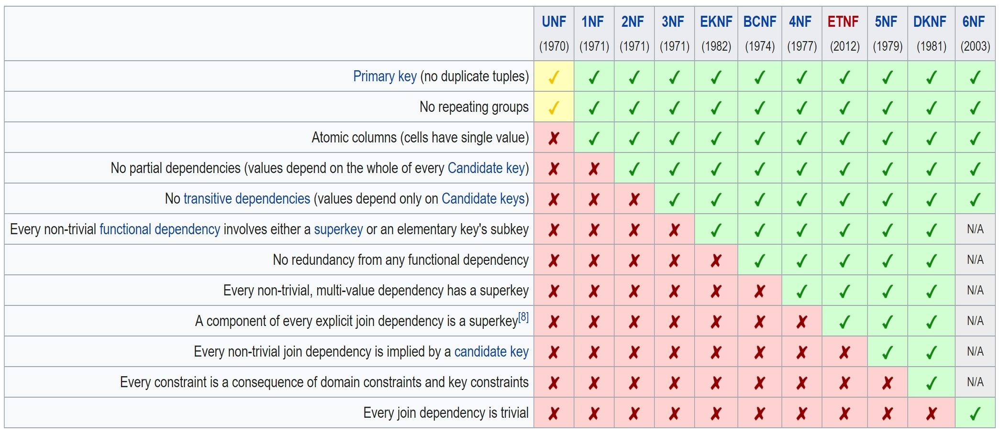

# [Design - DB Design](https://confluence.softserveinc.com/display/AbilitonKnowledgeModel/Design-DB+Design)

A database is an organized collection of data, generally stored and accessed electronically from a computer system.  

## [Relational database](https://en.wikipedia.org/wiki/Relational_database)
A relational database is a digital database based on the relational model of data.  

This model organizes data into one or more tables (or "relations") of columns and rows, with a unique key identifying each row.  
Rows are also called records or tuples.  
Columns are also called attributes. Generally, each table/relation represents one "entity type" (such as customer or product).  
The rows represent instances of that type of entity (such as "Lee" or "chair") 
and the columns representing values attributed to that instance (such as address or price).  

The purpose of the relational model is to provide a declarative method for specifying data and queries:   
users directly state what information the database contains and what information they want from it, 
and let the database management system software take care of describing data structures for storing the data 
and retrieval procedures for answering queries.  

* Present the data to the user as relations (a presentation in tabular form, i.e. as a collection of tables with each table consisting of a set of rows and columns);
* Provide relational operators to manipulate the data in tabular form.  

### The general structure of a relational database

## [NoSQL](https://en.wikipedia.org/wiki/NoSQL)
A NoSQL (originally referring to "non SQL" or "non relational") database provides a mechanism for storage and retrieval of data that is modeled in means other than the tabular relations used in relational databases.  

## Terminology 

### Entities
An entity is any object in the system that we want to model and store information about.  
Entities are usually recognizable concepts, either concrete or abstract, such as person, places, things, 
or events which have relevance to the database.  
Some specific examples of entities are Employee, Student, Lecturer.  

### Attributes
An attribute defines the information about the entity that needs to be stored.  
For example, the entity 'lecturer' could have attributes such as staff id, surname, forename, date of birth, telephone number, etc.  
An attribute can only appear in one entity, unless it is the key attribute in another entity.  
In a traditional filing system an attribute equates to a field in a record.

### Records (Tuples)
A complete set of information. Records are composed of fields, each of which contains one item of information.  
In a relational database, a tuple contains all the data for an individual record.  

In the context of a relational database, a row—also called a tuple—represents a single, implicitly structured data item in a table.   
In simple terms, a database table can be thought of as consisting of rows and columns.  
Each row in a table represents a set of related data, and every row in the table has the same structure.  

### Primary key
The primary key of a relational table uniquely identifies each record in the table.  
It can either be a normal attribute that is guaranteed to be unique or it can be generated by the DBMS.  

### Foreign key
A field in a relational table that matches a candidate key of another table.  
The foreign key can be used to cross-reference tables.

## ACID 
ACID (Atomicity, Consistency, Isolation, Durability) is a set of properties of database transactions intended to guarantee validity even in the event of errors, power failures, etc.  
In the context of databases, a sequence of database operations that satisfies the ACID properties (and these can be perceived as a single logical operation on the data) is called a transaction.  
For example, a transfer of funds from one bank account to another, even involving multiple changes such as debiting one account and crediting another, is a single transaction.  

### Atomicity
Transactions are often composed of multiple statements.   
Atomicity guarantees that each transaction is treated as a single "unit", which either succeeds completely, or fails completely:  
if any of the statements constituting a transaction fails to complete, the entire transaction fails and the database is left unchanged.  
An atomic system must guarantee atomicity in each and every situation, including power failures, errors and crashes.

### Consistency
Consistency ensures that a transaction can only bring the database from one valid state to another, maintaining database invariants:  any data written to the database must be valid according to all defined rules, including constraints, cascades, triggers, and any combination thereof.  
This prevents database corruption by an illegal transaction, but does not guarantee that a transaction is correct.  
Referential integrity guarantees the primary key - foreign key relationship.

### Isolation
Transactions are often executed concurrently (e.g., reading and writing to multiple tables at the same time).  
Isolation ensures that concurrent execution of transactions leaves the database in the same state that would have been obtained if the transactions were executed sequentially.  
Isolation is the main goal of concurrency control; depending on the method used, the effects of an incomplete transaction might not even be visible to other transactions.

### Durability
Durability guarantees that once a transaction has been committed, it will remain committed even in the case of a system failure (e.g., power outage or crash).  
This usually means that completed transactions (or their effects) are recorded in non-volatile memory.

Implementation: Locking vs multiversioning

## Relationships (One-to-One, One-to-Many)
https://support.airtable.com/hc/en-us/articles/218734758-A-beginner-s-guide-to-many-to-many-relationships

__One-to-One__ (1-1) relationship is defined as the relationship between two tables where both the tables should be associated with each other based on only one matching row.  
This relationship can be created using Primary key-Unique foreign key constraints.  
With One-to-One Relationship in SQL Server, for example, a person can have only one passport.  

__One-to-Many__ relationship is defined as a relationship between two tables where a row from one table can have multiple matching rows in another table.   
This relationship can be created using Primary key-Foreign key relationship.  
For example, if you have a list of works of art and a list of museums, each work of art can only be in one museum at a time, but each museum can have many works of art.  

__Many-to-Many__ - For example, think of A as Authors, and B as Books. An Author can write several Books, and a Book can be written by several Authors.

## Understanding ER notation
Entity-relationship diagrams (ERD) are essential to modeling anything from simple to complex databases.  
ER diagrams are used to model and design relational databases, in terms of logic and business rules (in a logical data model) and in terms of the specific technology to be implemented (in a physical data model.)  

Components and features
* Entity
  * Strong entity
  * Weak entity
  * Associative entity
* Relationship 
  * Relationship
  * Weak relationship
* Attribute 
  * Attribute
  * Multivalued attribute
  * Derived attribute
	
Physical diagram symbols
* Fields	
* Keys
* Types
  
Relationship notations

## Understanding normalization concept

Database normalization is the process of structuring a relational database in accordance with a series of so-called normal forms in order to reduce data redundancy and improve data integrity.  

Normalization entails organizing the columns (attributes) and tables (relations) of a database to ensure that their dependencies are properly enforced by database integrity constraints. It is accomplished by applying some formal rules either by a process of synthesis (creating a new database design) or decomposition (improving an existing database design).  

A fully normalized database allows its structure to be extended to accommodate new types of data without changing existing structure too much. As a result, applications interacting with the database are minimally affected.  
Normalized relations, and the relationship between one normalized relation and another, mirror real-world concepts and their interrelationships.  

When an attempt is made to modify (update, insert into, or delete from) a relation, the following undesirable side-effects may arise in relations that have not been sufficiently normalized:  
* Update anomaly. The same information can be expressed on multiple rows.  
* Insertion anomaly. There are circumstances in which certain facts cannot be recorded at all. NULL in field.  
* Deletion anomaly. Under certain circumstances, deletion of data representing certain facts necessitates deletion of data representing completely different facts.  

Normalization is a database design technique, which is used to design a relational database table up to higher normal form.  
The process is progressive, and a higher level of database normalization cannot be achieved unless the previous levels have been satisfied.  

### Normal forms

Unnormalized form (UNF)
is a simple database data model lacking the efficiency of database normalization.  

#### First normal form (1NF)  
Is a property of a relation in a relational database.  
A relation is in first normal form if and only if the domain of each attribute contains only atomic (indivisible) values, and the value of each attribute contains only a single value from that domain.  
First normal form enforces these criteria:  
* Eliminate repeating groups in individual tables
* Create a separate table for each set of related data[definition needed]
* Identify each set of related data with a primary key

According to Date's definition, a table is in first normal form if and only if it is "isomorphic to some relation", which means, specifically, that it satisfies the following five conditions:
* There's no top-to-bottom ordering to the rows.
* There's no left-to-right ordering to the columns.
* There are no duplicate rows.
* Every row-and-column intersection contains exactly one value from the applicable domain (and nothing else).
* All columns are regular [i.e. rows have no hidden components such as row IDs, object IDs, or hidden timestamps].

#### Second normal form (2NF)

To qualify for second normal form a relation must:
not have any non-prime attribute that is dependent on any proper subset of any candidate key of the relation.  
A non-prime attribute of a relation is an attribute that is not a part of any candidate key of the relation.  

Put simply, a relation is in 2NF if it is in 1NF and every non-prime attribute of the relation is dependent on the whole of every candidate key.  

#### Third normal form (3NF) 

Is a normal form that is used in normalizing a database design to reduce the duplication of data and ensure referential integrity by ensuring that:  
No non-prime (non-key) attribute is transitively dependent of any key i.e. no non-prime attribute depends on other non-prime attributes. All the non-prime attributes must depend on the primary key only.

### Denormalization

Denormalization is a strategy used on a previously-normalized database to increase performance.   
In computing, denormalization is the process of trying to improve the read performance of a database, at the expense of losing some write performance, by adding redundant copies of data or by grouping data.  

## Data Integrity
