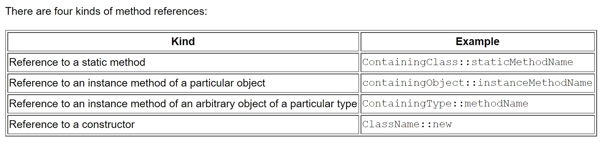

# [Construction - Language - Java](https://confluence.softserveinc.com/display/AbilitonKnowledgeModel/Construction-Language-Java)

## CL1 (Qualified)
__Qualification Requirements Overview:__  
Knowledge of java language specification and main packages is required.  


### Identifiers & JavaBeans


### Declare Classes


### Declare Interfaces


### Declare Class Members


### Reference Variable Casting


### Implementing an Interface


### Legal Return Types


### Constructors and Instantiation


### Statics

https://docs.oracle.com/javase/tutorial/java/IandI/override.html
https://www.geeksforgeeks.org/can-we-overload-or-override-static-methods-in-java
Static method cannot be overrided by child. It __hide__ method from parent and have it's own unique static method.

The distinction between hiding a static method and overriding an instance method has important implications:
* The version of the overridden instance method that gets invoked is the one in the subclass.
* The version of the hidden static method that gets invoked depends on whether it is invoked from the superclass or the subclass.

### [Stack and Heap](https://www.baeldung.com/java-stack-heap)
To run an application in an optimal way, JVM divides memory into stack and heap memory.  

Stack Memory in Java is used for static memory allocation and the execution of a thread. It contains primitive values that are specific to a method and references to objects that are in a heap, referred from the method.  

* Access to this memory is in Last-In-First-Out (LIFO) order.   
* It grows and shrinks as new methods are called and returned respectively
* Variables inside stack exist only as long as the method that created them is running
* It’s automatically allocated and deallocated when method finishes execution
* If this memory is full, Java throws java.lang.StackOverFlowError
* Access to this memory is fast when compared to heap memory
* This memory is threadsafe as each thread operates in its own stack

Heap space in Java is used for dynamic memory allocation for Java objects and JRE classes at the runtime. New objects are always created in heap space and the references to this objects are stored in stack memory.  
These objects have global access and can be accessed from anywhere in the application.  

This memory model is further broken into smaller parts called generations, these are:

1. Young Generation – this is where all new objects are allocated and aged. A minor Garbage collection occurs when this fills up
2. Old or Tenured Generation – this is where long surviving objects are stored. When objects are stored in the Young Generation, a threshold for the object’s age is set and when that threshold is reached, the object is moved to the old generation
3. Permanent Generation – this consists of JVM metadata for the runtime classes and application methods

* It’s accessed via complex memory management techniques that include Young Generation, Old or Tenured Generation, and Permanent Generation
* If heap space is full, Java throws java.lang.OutOfMemoryError
* Access to this memory is relatively slower than stack memory
* This memory, in contrast to stack, isn’t automatically deallocated. It needs Garbage Collector to free up unused objects so as to keep the efficiency of the memory usage
* Unlike stack, a heap isn’t threadsafe and needs to be guarded by properly synchronizing the code


### Literals, Assignments, and Variables


### Passing Variables into Methods
Java always pass by value.
Since the variables are just the reference to the objects, we get confused that we are passing the reference so java is pass by reference. However we are passing a copy of the reference and hence it’s pass by value.
https://www.journaldev.com/3884/java-is-pass-by-value-and-not-pass-by-reference

https://docs.oracle.com/javase/tutorial/java/javaOO/arguments.html

Reference data type parameters, such as objects, are also passed into methods by value. This means that when the method returns, the passed-in reference still references the same object as before. However, the values of the object's fields can be changed in the method, if they have the proper access level.

### Array Declaration, Construction, and Initialization


### Java Operators


### if and switch Statements


### Loops and Iterators

### Handling Exceptions


### Common Exceptions and Errors


### String, StringBuilder, and StringBuffer


### Using the javac and java Commands


### String literals in switch statements


### Underscores in literals to improve code readability


### try-with-resources block and exception handling


### Catching multiple exception types


### Rethrowing exceptions in Java 7


### Using the diamond operator for constructor type inference


### [Using the @SafeVarargs annotation](https://www.baeldung.com/java-safevarargs)
warning: [unchecked] Possible heap pollution from parameterized vararg type T
To squash this warning, we can add the @SafeVarargs annotation on final or static methods and constructors.

@SafeVarargs is like @SupressWarnings in that it allows us to declare that a particular compiler warning is a false positive. Once we ensure our actions are safe, we can add this annotation

## Java 8 features 


### [Default and Static Methods](https://docs.oracle.com/javase/tutorial/java/IandI/defaultmethods.html)

https://www.geeksforgeeks.org/default-methods-java  

If a new method is to be added in an interface, then its implementation code has to be provided in the class implementing the same interface. To overcome this issue, Java 8 has introduced the concept of default methods which allow the interfaces to have methods with implementation without affecting the classes that implement the interface.  

The default methods were introduced to provide backward compatibility so that existing intefaces can use the lambda expressions without implementing the methods in the implementation class. Default methods are also known as __defender methods__ or __virtual extension methods.__

In case both the implemented interfaces contain deafult methods with same method signature, the implementing class should explicitly specify which default method is to be used or it should override the default method.  

Important Points:
* Interfaces can have default methods with implementation from java 8 onwards.
* Interfaces can have static methods as well similar to static method of classes.
* Default methods were introduced to provide backward compatibility for old interfaces so that they can have new methods without effecting existing code.

Overriding default method in class (without keyword default and with public access lvl) is allowed.

https://www.geeksforgeeks.org/static-method-in-interface-in-java
Unlike other methods in Interface, these static methods contain the complete definition of the function and since the definition is complete and the method is static, therefore these methods cannot be overridden or changed in the implementation class.  

Similar to Default Method in Interface, the static method in an interface can be defined in the interface, but these methods cannot be overridden in Implementation Classes.  

To use a static method, Interface name should be instantiated with it, as it is __a part of the Interface only.__  


## Java 10 features

### Local-Variable Type Inference

Only for local variables with the initializer.  
var is not a keyword  
won’t work without the initializer or null  
won’t work for non-local variables: public var = "hello";  
won't work with lambda (changed in Java 11)
won't work with arrays

### Time-Based release versioning
The new time-based model has replaced the feature-based, multi-year release model of the past. Unlike the old releases, the new time-based releases will not be delayed and features will be released every six months, with no constraints on what features can go out in the releases.   

The updates releases will occur every quarter (Jan, April, July, Oct). Update releases will be strictly limited to fixes of security issues, regressions, and bugs in newer features.  

LTS version of the products will offer premier and sustained support from Oracle and it will be targeted every 3 years. Also, updates for these releases will be available for at least three years.  


## CL2 (Competent)

__Qualification Requirements Overview:__  
Capability to pass Oracle Certified Professional Java Programmer Exam.

### Using Wrapper Classes and Boxing

### Overloading


### Garbage Collection
https://www.geeksforgeeks.org/garbage-collection-java/  
System.gc() method  
Runtime.getRuntime().gc() method  

There is no guarantee that any one of above two methods will definitely run Garbage Collector.  
Just before destroying an object, Garbage Collector calls finalize() method on the object to perform cleanup activities. Once finalize() method completes, Garbage Collector destroys that object.  

In reality, the time at which the garbage collector calls finalizers is dependent on the JVM’s implementation and the system’s conditions, which are out of our control.  

finalize has been deprecated starting with Java 9 – and will eventually be removed.  

### Working with the Assertion Mechanism


### File Navigation and I/O


### Dates, Numbers, and Currency
java.util.Date  
java.util.Calendar  
java.util.Locale The Locale class allows us to create an object that represents a specific geographical, political, or cultural region of the world  
java.text.NumberFormat The NumberFormat class provides us with methods to format numbers and currencies for different locales  
java.text.DateFormat The DateFormat class provides us with methods to format dates in various styles and for different locales  

### Parsing,Tokenizing, and Formatting
Regular Expression  
```
Pattern p = Pattern.compile("aba");      
Matcher m = p.matcher("abababa");
```

Tokenizing  
Tokens are the actual pieces of data.  
There are 2 classes capable of tokenizing: String with String[] split(String regex) method and Scanner.  
Delimiters are the expressions that separate the tokens from each other; if supported, an delimiter can be a regex.  

Formating  
System.out.printf  and  System.out.format  

### Overriding hashCode() and equals()

HashMap and HashSet use the hashcode value of an object to find out how the object would be stored in the collection, and subsequently hashcode is used to help locate the object in the collection. 

Not overriding both of them will prevent your class from functioning properly in conjunction with all hash-based collections, including HashMap, HashSet, and Hashtable. (Joshua Bloch)  

Whenever it(hashcode) is invoked on the same object more than once during an execution of a Java application, the hashCode method must consistently return the same integer.

If two objects are equal according to the equals(Object) method, then calling the hashCode method on each of the two objects must produce the same integer result.

It is not required that if two objects are unequal according to the equals(java.lang.Object) method, then calling the hashCode method on each of the two objects must produce distinct integer results.   


### [Collections](https://docs.oracle.com/javase/tutorial/collections/TOC.html)

https://docs.oracle.com/javase/8/docs/api/java/util/Collection.html

Collections extended by List (LinkedList, ArrayList, Vector), Queue (LinkedList, PriorityQueue) and Set (HashSet, TreeSet, LinkedHashSet).  


__Some highlights:__

The java.util.concurrent package contains several collections implementations, which are thread-safe but not governed by a single exclusion lock.  

The Collections class (as opposed to the Collection interface), provides static methods that operate on or return collections, which are known as Wrapper implementations.  


#### Interfaces  
* The first tree starts with the Collection interface, which provides for the basic functionality used by all collections, such as add and remove methods. Its subinterfaces — Set, List, and Queue — provide for more specialized collections.
The Set interface does not allow duplicate elements. This can be useful for storing collections such as a deck of cards or student records. The Set interface has a subinterface, SortedSet, that provides for ordering of elements in the set.

* The List interface provides for an ordered collection, for situations in which you need precise control over where each element is inserted. You can retrieve elements from a List by their exact position.

* The Queue interface enables additional insertion, extraction, and inspection operations. Elements in a Queue are typically ordered in on a FIFO basis.

* The Deque interface enables insertion, deletion, and inspection operations at both the ends. Elements in a Deque can be used in both LIFO and FIFO.

* The second tree starts with the Map interface, which maps keys and values similar to a Hashtable.

* Map's subinterface, SortedMap, maintains its key-value pairs in ascending order or in an order specified by a Comparator.

#### Implementation
* For the Set interface, HashSet is the most commonly used implementation.
* For the List interface, ArrayList is the most commonly used implementation.
* For the Map interface, HashMap is the most commonly used implementation.
* For the Queue interface, LinkedList is the most commonly used implementation.
* For the Deque interface, ArrayDeque is the most commonly used implementation.


## [Map](https://docs.oracle.com/javase/tutorial/collections/interfaces/map.html)
HashTable, HashMap, TreeMap, LinkedHashMap.  
https://habr.com/ru/post/128017  


A Map is an object that maps keys to values. A map cannot contain duplicate keys: Each key can map to at most one value. It models the mathematical function abstraction. The Map interface includes methods for basic operations (such as put, get, remove, containsKey, containsValue, size, and empty), bulk operations (such as putAll and clear), and collection views (such as keySet, entrySet, and values).  

The Java platform contains three general-purpose Map implementations: HashMap, TreeMap, and LinkedHashMap.  

### HashMap

#### [Collisions](https://www.geeksforgeeks.org/internal-working-of-hashmap-java)

In case of hash collision entry objects are stored as a node in a linked-list and equals() method is used to compare keys. That comparison to find the correct key with in a linked-list is a linear operation so in a worst case scenario the complexity becomes O(n).
To address this issue, Java 8 hash elements use balanced trees instead of linked lists after a certain threshold is reached.

#### [get() with collisions](https://www.geeksforgeeks.org/internal-working-of-hashmap-java)
Steps:

1. Calculate hash code of Key {“sachin”}. It will be generated as 115.
2. Calculate index by using index method it will be 3.
3. Go to index 3 of array and compare first element’s key with given key. If both are equals then return the value, otherwise check for next element if it exists.

### Using the Collections Framework

### Generic Types

T vs ?
https://stackoverflow.com/a/28760323/4355903 
There are certain places, where wildcards, and type parameters do the same thing. But there are also certain places, where you have to use type parameters.  
If you want to enforce some relationship on the different types of method arguments, you can't do that with wildcards, you have to use type parameters.  

https://www.quora.com/What-is-the-difference-between-using-T-and-a-wildcard-in-Java-Generics

Some difference between using wildcards and type parameters:
* If you have only one parameterized type argument, then you can use wildcard, although type parameter will also work.
* Type parameters support multiple bounds, wildcards don't.
* Wildcards support both upper and lower bounds, type parameters just support upper bounds. 

```
public static <T extends Number> void copy(List<T> dest, List<T> src)
public static void copy(List<? extends Number> dest, List<? extends Number> src)
```
In 2nd case, you can pass List<Integer> and List<Float>  

Why Use Generics?
* Stronger type checks at compile time
* Elimination of casts
* Enabling programmers to implement generic algorithms

### JAR Files

### Static Imports

### Serialization
Serialization is a mechanism of converting the state of an object into a byte stream.   
To make a Java object serializable we implement the java.io.Serializable interface.  
 
Advantages of Serialization
1. To save/persist state of an object.
2. To travel an object across a network.

* Only non-static data members are saved via Serialization process.
* Static data members and transient data members are not saved via Serialization 

#### SerialVersionUID
The Serialization runtime associates a version number with each Serializable class called a SerialVersionUID, which is used during Deserialization to verify that sender and reciever of a serialized object have loaded classes for that object which are compatible with respect to serialization.  


### Inner Classes
Inner class means one class which is a member of another class. There are basically four types of inner classes in java.

###  Nested Inner class  
Nested Inner class can access any private instance variable of outer class. Like any other instance variable, we can have access modifier private, protected, public and default modifier.
Like class, interface can also be nested and can have access specifiers.
We can’t have static method in a nested inner class.  

###  Method Local inner classes 
Inner class can be declared within a method of an outer class.  

###  Anonymous inner classes  
Anonymous inner classes are declared without any name at all. They are created in two ways:   
* As subclass of specified type
* As implementer of the specified interface

###  Static nested classes  
Static nested classes are not technically an inner class. They are like a static member of outer class.

### Reflection
Reflection is an API which is used to examine or modify the behavior of methods, classes, interfaces at runtime.  
* The required classes for reflection are provided under java.lang.reflect package.
* Reflection gives us information about the class to which an object belongs and also the methods of that class which can be executed by using the object.
* Through reflection we can invoke methods at runtime irrespective of the access specifier used with them.

Advantages of Using Reflection:
* Extensibility Features: An application may make use of external, user-defined classes by creating instances of extensibility objects using their fully-qualified names.
* Debugging and testing tools: Debuggers use the property of reflection to examine private members on classes.

Drawbacks:
* Performance Overhead: Reflective operations have slower performance than their non-reflective counterparts, and should be avoided in sections of code which are called frequently in performance-sensitive applications.
* Exposure of Internals: Reflective code breaks abstractions and therefore may change behavior with upgrades of the platform.

sun.misc.Unsafe consists of 105 methods

### Annotations


### Locating Files and Directories Using Paths


### Obtaining and Managing Files and Directories


### Working with Filesystems in Java 7


### Stream IO in Java 7


## Java 8 features

### [Functional interface](https://www.geeksforgeeks.org/functional-interfaces-java)

A functional interface is an interface that contains only one abstract method. They can have only one functionality to exhibit. From Java 8 onwards, lambda expressions can be used to represent the instance of a functional interface. A functional interface can have any number of default methods. Runnable, ActionListener, Comparable are some of the examples of functional interfaces.  

#### @FunctionalInterface Annotation
@FunctionalInterface annotation is used to ensure that the functional interface can’t have more than one abstract method. In case more than one abstract methods are present, the compiler flags an ‘Unexpected @FunctionalInterface annotation’ message. However, it is not mandatory to use this annotation.  

#### java.util.function Package
The java.util.function package in Java 8 contains many builtin functional interfaces like:  


##### Supplier
Represents a supplier of results.  
There is no requirement that a new or distinct result be returned each time the supplier is invoked.  
It is typically used for lazy generation of values.  
```
public interface Supplier<T> {
    T get();
}
```

##### Consumer  
Represents an operation that accepts a single input argument and returns no result. 
Unlike most other functional interfaces, Consumer is expected to operate via side-effects.  
```
@FunctionalInterface
public interface Consumer<T> {
    void accept(T t);
}
```

##### Predicate 
In mathematical logic, a predicate is a function that receives a value and returns a boolean value.  
The Predicate interface has an abstract method test which gives a Boolean value as a result for the specified argument.  
The Predicate functional interface is a specialization of a Function that receives a generified value and returns a boolean.  
A typical use case of the Predicate lambda is to filter a collection of values.  
```
public Predicate  
{  
   public boolean test(T  t);
 }
```

##### Function 
Represents a function that accepts one argument and produces a result.  
The Function interface has an abstract method apply which takes argument of type T and returns a result of type R.   
Applies this function to the given argument.  
Its prototype is public interface Function.
```
{
   public R apply(T t);
}
```

### [Lambdas](https://docs.oracle.com/javase/tutorial/java/javaOO/lambdaexpressions.html)


Lambda expressions enable you to treat functionality as method argument, or code as data. 

A lambda expression consists of the following:
* A comma-separated list of formal parameters enclosed in parentheses. You can omit the data type of the parameters in a lambda expression. In addition, you can omit the parentheses if there is only one parameter. 
* The arrow token, ->
* A body, which consists of a single expression or a statement block. If you specify a single expression, then the Java runtime evaluates the expression and then returns its value. A return statement is not an expression; in a lambda expression, you must enclose statements in braces ({}). However, you do not have to enclose a void method invocation in braces.

#### Accessing Local Variables of the Enclosing Scope

Lambda expressions are lexically scoped. This means that they do not inherit any names from a supertype or introduce a new level of scoping. Declarations in a lambda expression are interpreted just as they are in the enclosing environment.  

Lambda expression can only access local variables and parameters of the enclosing block that are final or effectively final.  
A variable or parameter whose value is never changed after it is initialized is effectively final.  
Simplest way to explain "effectively final" is to imagine adding the final modifier to a variable declaration. If, with this change, the program continues to behave in the same way, both at compile time and at run time, then that variable is effectively final.  

To determine the type of a lambda expression, the Java compiler uses the target type of the context or situation in which the lambda expression was found.  


### [Method references](https://docs.oracle.com/javase/tutorial/java/javaOO/methodreferences.html)
The method reference is semantically the same as the lambda expression.  




Lambda:  
Arrays.sort(rosterAsArray,
    (a, b) -> Person.compareByAge(a, b)
);

Because this lambda expression invokes an existing method, you can use a method reference instead of a lambda expression:  

Arrays.sort(rosterAsArray, Person::compareByAge);

Each has the following characteristics:  
* Its formal parameter list is copied from Comparator<Person>.compare, which is (Person, Person).
* Its body calls the method Person.compareByAge.
  


### [Stream API](https://docs.oracle.com/javase/tutorial/collections/streams/index.html)

A __pipeline__ is a sequence of aggregate operations.  
A pipeline contains the following components:
* A source
* Zero or more intermediate operations
* A terminal operation

#### Differences Between Aggregate Operations and Iterators
Aggregate operations, like forEach, appear to be like iterators. However, they have several fundamental differences:
* They use internal iteration: Aggregate operations do not contain a method like next to instruct them to process the next element of the collection.
* They process elements from a stream: Aggregate operations process elements from a stream, not directly from a collection.
* They support behavior as parameters: You can specify lambda expressions as parameters for most aggregate operations. This enables you to customize the behavior of a particular aggregate operation.

#### Laziness
All intermediate operations are lazy. An expression, method, or algorithm is lazy if its value is evaluated only when it is required.

#### Interference
Lambda expressions in stream operations should not interfere. Interference occurs when the source of a stream is modified while a pipeline processes the stream. 

#### Stateful Lambda Expressions
Avoid using stateful lambda expressions as parameters in stream operations. A stateful lambda expression is one whose result depends on any state that might change during the execution of a pipeline.

#### Some methods
https://habr.com/ru/company/luxoft/blog/270383

Intermediate Operations:

##### map 
The map method is used to map the items in the collection to other objects according to the Predicate passed as argument

##### filter 
The filter method is used to select elements as per the Predicate passed as argument.

##### sorted
The sorted method is used to sort the stream.

##### distinct
##### peek
##### limit
##### skip

Terminal Operations:

##### forEach
The forEach method is used to iterate through every element of the stream.  

##### reduce
Method is a general-purpose reduction operation.
The reduce operation can takes two arguments:
* identity: The identity element is both the initial value of the reduction and the default result if there are no elements in the stream.
* accumulator: The accumulator function takes two parameters: a partial result of the reduction and the next element of the stream.

##### collect
The collect method modifies, or mutates, an existing value.  
The collect method is used to return the result of the intermediate operations performed on the stream.

##### findFirst 
Return first element of the stream (return Optional)

##### findAny 
Return any element of the stream (return Optional)

##### count
Return number of elements in the stream.

##### anyMatch
Return true if the condition is true for at least one element of the stream

##### allMatch

##### min

##### max

##### toArray

#### Parallelism
Parallel computing involves dividing a problem into subproblems, solving those problems simultaneously (in parallel, with each subproblem running in a separate thread), and then combining the results of the solutions to the subproblems.   

You can execute streams in serial or in parallel. When a stream executes in parallel, the Java runtime partitions the stream into multiple substreams. Aggregate operations iterate over and process these substreams in parallel and then combine the results.  


### [Method parameter reflection](https://docs.oracle.com/javase/tutorial/reflect/member/methodparameterreflection.html)
You can obtain the names of the formal parameters of any method or constructor with the method java.lang.reflect.Executable.getParameters  
However, .class files do not store formal parameter names by default.  
To store formal parameter names in a particular .class file, and thus enable the Reflection API to retrieve formal parameter names, compile the source file with the -parameters option to the javac compiler.  

More:
https://www.beyondjava.net/reading-java-8-method-parameter-named-reflection

### [New Date API](https://www.geeksforgeeks.org/new-date-time-api-java8)
https://www.baeldung.com/java-8-date-time-intro

New date-time API is introduced in Java 8 to overcome the following drawbacks of old date-time API:
* Not thread safe : Unlike old java.util.Date which is not thread safe the new date-time API is immutable and doesn’t have setter methods.
* Less operations : In old API there are only few date operations but the new API provides us with many date operations.

java.time:
* Local : Simplified date-time API with no complexity of timezone handling
* Zoned : Specialized date-time API to deal with various timezones
* LocalDate/LocatTime and LocalDateTime API : Use it when time zones are NOT required. 

__The LocalDate__ represents a date in ISO format (yyyy-MM-dd) without time.  
```
LocalDate localDate = LocalDate.now();
LocalDate.of(2015, 02, 20);
LocalDate.parse("2015-02-20");
LocalDate tomorrow = LocalDate.now().plusDays(1);
LocalDate previousMonthSameDay = LocalDate.now().minus(1, ChronoUnit.MONTHS);
```

__The LocalTime__ represents time without a date.  
```
LocalTime now = LocalTime.now();
LocalTime sixThirty = LocalTime.of(6, 30);
LocalTime sixThirty = LocalTime.parse("06:30");
```

__The LocalDateTime__ is used to represent a combination of date and time.  
```
LocalDateTime.of(2015, Month.FEBRUARY, 20, 06, 30);
LocalDateTime.parse("2015-02-20T06:30:00");
```

__ZonedDateTime__ when we need to deal with time zone specific date and time. The ZoneId is an identifier used to represent different zones. There are about 40 different time zones and the ZoneId are used to represent them as follows.  
```
ZoneId zoneId = ZoneId.of("Europe/Paris");
Set<String> allZoneIds = ZoneId.getAvailableZoneIds();
ZonedDateTime.parse("2015-05-03T10:15:30+01:00[Europe/Paris]");
```

__The Period__ class represents a quantity of time in terms of years, months and days and the __Duration__ class represents a quantity of time in terms of seconds and nano seconds.


Period and Duration classes :
* Period : It deals with date based amount of time.
* Duration : It deals with time based amount of time.

ChronoUnits Enum: java.time.temporal.ChronoUnit enum is added in Java 8 to replace integer values used in old API to represent day, month etc.

TemporalAdjuster : It is used to perform various date related operations

#### Date and Time Formatting
```
String localDateString = localDateTime.format(DateTimeFormatter.ISO_DATE);
localDateTime.format(DateTimeFormatter.ofPattern("yyyy/MM/dd"));

```

#### Issues with the Existing Date/Time APIs
* Thread Safety
* Poor APIs Design and Ease of Understanding
* Developers had to write additional logic to handle timezone logic with the old APIs

## Java 9 features

### [Java Platform Module System](https://www.baeldung.com/java-9-modularity)

A Module is a group of closely related packages and resources along with a new module descriptor file.  
Each module is responsible for its resources, like media or configuration files.  

Previously we’d put all resources into the root level of our project and manually manage which resources belonged to different parts of the application.  
With modules, we can ship required images and XML files with the module that needs it, making our projects much easier to manage.  

To set up a module, we need to put a special file at the root of our packages named module-info.java.

Java Module Benefits
Smaller Application Distributables
Encapsulation of Internal Packages
Startup Detection of Missing Modules

#### Module Descriptor
When we create a module, we include a descriptor file that defines several aspects of our new module:
* Name – the name of our module
* Dependencies – a list of other modules that this module depends on
* Public Packages – a list of all packages we want accessible from outside the module
* Services Offered – we can provide service implementations that can be consumed by other modules
* Services Consumed – allows the current module to be a consumer of a service
* Reflection Permissions – explicitly allows other classes to use reflection to access the private members of a package

We need to list all packages we want to be public because by default all packages are module private.

Module Types
* System Modules – These are the modules listed when we run the list-modules command above. They include the Java SE and JDK modules.
* Application Modules – These modules are what we usually want to build when we decide to use Modules. They are named and defined in the compiled module-info.class file included in the assembled JAR.
* Automatic Modules – We can include unofficial modules by adding existing JAR files to the module path. The name of the module will be derived from the name of the JAR. Automatic modules will have full read access to every other module loaded by the path.
* Unnamed Module – When a class or JAR is loaded onto the classpath, but not the module path, it’s automatically added to the unnamed module. It’s a catch-all module to maintain backward compatibility with previously-written Java code.


### Other Java 8 features
* Java Lambda Expressions
* Java Streams (functional streams)
* JavaFX (bundled with Java SE from Java 8).
* The Nashorn JavaScript engine.

### Other Java 9 features
* Java Modules
* Java Reflection Module class
* Experimental HTTP Client
* JShell
* Java Try With Resources Enhancement
Before Java 9 a resource that is to be automatically closed must be created inside the parentheses of the try block of a try-with-resources construct. From Java 9, this is no longer necessary. If the variable referencing the resource is effectively final, you can simply enter a reference to the variable inside the try block parentheses.  
```
FileInputStream input = new FileInputStream("file.txt");
    try(input) {...}
```
You can use multiple resources inside a Java try-with-resources block and have them all automatically closed.   
Custom AutoClosable Implementations

* Java Compact Strings
The compact strings feature lets the Java VM detect if a string only contains ISO-8859-1/Latin-1 characters. If it does, the String will only use 1 byte per character internally. The characters of a compact Java String can thus be represented by a byte array instead of a char array.  
* Java Microbenchmark Harness (JMH) included in the JDK
http://tutorials.jenkov.com/java-performance/jmh.html  

### Other Java 10 features
* Local-Variable Type Inference
* Parallel Full Garbage Collection for G1 (a Garbage Collector)
* Graal included as experimental JIT compiler
* Several internal, JVM and platform level changes

### Other Java 11 features
* Removed Java EE and Corba modules from JDK.
* HTTP Client made standard (the one added in Java 9).
* Java var keyword allowed as lambda expression parameter type.
* Key agreement via elliptic curve cryptography.
* Unicode 10.
* New cryptographic algorithms.
* Launch single file source code programs (compiled when executed).
* TLS 1.3 support.
* Deprecate the Nashorn JavaScript engine

### Other Java 12 features
* A low pause time garbage collector called Shenandoah.
* Java switch expressions (preview - may be removed from Java again).
* JVM Constants API.
* Abortable mixed collections in G1 (garbage collections).
* Promptly return unused committed memory from G1.

http://tutorials.jenkov.com/java/index.html
